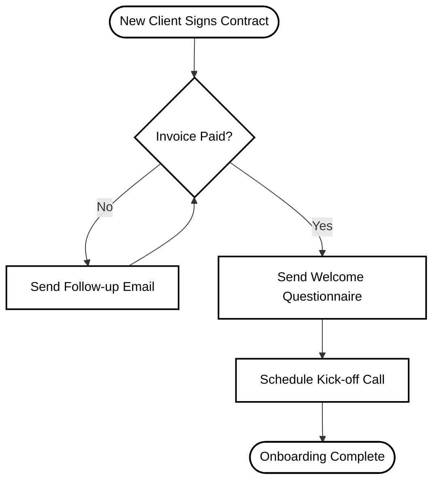

# Welcome to SystemLab: The Ultimate Guide

SystemLab is your team's operating system. It’s where you document exactly how your business runs so anyone can step in, read the instructions, and get the job done right. 

---

## 1. Why Use SystemLab?

- **No More Repeating Yourself:** Stop answering the same questions every day. Write the process once, and point your team to SystemLab.
- **Easy Onboarding:** New employees can learn how to do their jobs without constant hand-holding.
- **Consistent Quality:** When everyone follows the same steps, your customers get the same high-quality result every single time.
- **Business Value:** A business with documented systems is easier to manage, easier to scale, and far more valuable if you ever decide to sell it.

## 2. When to Use SystemLab?

You should create an SOP (Standard Operating Procedure) in SystemLab when a task is:
- **Repetitive:** Something done daily, weekly, or monthly (e.g., "How to process payroll").
- **Important:** If done wrong, it costs you money or upsets customers (e.g., "How to onboard a new client").
- **Time-Consuming:** Tasks that take up too much of the founder's time and need to be delegated.
- **Complex:** Tasks with multiple steps that are easy to forget (e.g., "How to publish a new blog post").

## 3. How to Use SystemLab

SystemLab is designed to be incredibly fast and simple to use.

### Basic Steps:
1. **Login:** Go to the live app and enter your Workspace Passcode (e.g. `admin`).
2. **Create:** Click the **+ New SOP** button.
3. **Write:** Use the editor on the left to write your steps. Use the insert buttons to easily add checklists, videos, or flowcharts.
4. **Preview:** Watch your document come to life instantly on the right side. You can click the **⛶ Full Screen** button for easier reading.
5. **Save:** Click **Save SOP**. Your work is safely saved and synced in the cloud.

### Pro Tips:
- **Click-to-Edit:** Notice a typo in the preview? Click right on the mistake in the preview pane, and the editor will instantly jump to the exact line of code so you can fix it!
- **Version History:** Don't worry about messing up. Click the **Versions** button to travel back in time and instantly restore old snapshots of your SOP.

---

## 4. How to Build Business Systems

Building a system just means figuring out the best way to do something, and writing it down. 

### Watch: The Basics of Systemizing

If you want a short, crisp introduction to building systems, watch this excellent 5-minute guide on YouTube:

  
*(Click the image to watch the video on YouTube)*

### The 4-Step Systemization Checklist

Use this simple checklist every time you want to build a system:

- [ ] **1. Pick ONE Priority:** Start with the most frustrating or repetitive task in your business. Do not try to systemize everything at once.
- [ ] **2. Record It:** Next time you do the task, record your screen (using a tool like Loom) and explain what you are doing out loud.
- [ ] **3. Document It:** Watch the video back and write down the steps as a simple bulleted list in SystemLab.
- [ ] **4. Test It:** Give the SystemLab SOP to someone else on your team. If they can complete the task without asking you questions, your system works!

### Visualizing: The Process Flowchart

Not sure how a process works? Draw it out first using SystemLab's Flowchart tool. Here is an example of how a simple Client Onboarding system might look:

> [!TIP]
> **Keep it Simple:** Focus on the 20% of the steps that get 80% of the results. You don't need a 50-page manual. A 5-step checklist in SystemLab paired with a 3-minute Loom video is usually much better!
