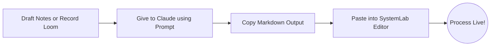

# Team Pixelizt: SystemLab Operating System Guide

Welcome to **SystemLab**, the official operating system for Team Pixelizt. This is where we document, update, and collaborate on all our Standard Operating Procedures (SOPs), processes, and knowledge base.

SystemLab is designed to be lightning-fast, simple, and clutter-free. It uses Markdown for writing and syncs everything instantly to the cloud.

---

## 🚀 How to Access SystemLab

1. Open the SystemLab application link (provided by your manager).
2. On the login screen, enter your **Work Email**.
3. Enter the Team Pixelizt passcode: `admin` (or `123456`).
4. Hit **Enter Workspace**.

> [!NOTE]
> SystemLab automatically saves your progress as you type. If you lose connection, your changes are stored locally and will sync to the cloud once you are back online.

---

## 📹 Best Practices: Writing Clear SOPs

The goal of an SOP is to allow a brand-new team member to execute a process flawlessly without having to ask questions.

1. **Keep it actionable:** Use clear, direct language. ("Click the blue button," not "The blue button should be clicked.")
2. **Use Loom:** If a process takes place on a computer, **always** include a Loom screen recording link at the top of the SOP. A 2-minute video saves 20 paragraphs of text.
3. **Use Markdown:** Use `#` for headings, `-` for bullet points, and `> ` for important callouts.

### Video Resource
If you are new to writing SOPs for business processes, watch this quick YouTube guide on the Start-Stop method for keeping procedures simple and actionable: [How to Write an SOP for Business](https://www.youtube.com/watch?v=1F2bF2W2lqM) (or search "How to write a standard operating procedure for business" on YouTube).

---

## 🤖 Using Claude to Generate SOPs

You can use AI (like Claude or ChatGPT) to do the heavy lifting when writing your SOPs. 

**CRITICAL:** Do not let the AI write generic, "random" fluff. You must provide it with your *actual business process* (e.g., a transcript of your Loom video or your rough notes).

### The Copy-Paste Claude Prompt

Copy the prompt below, paste it into Claude, and fill in the bracketed `[ ]` information with your actual steps:

```text
I am creating a Standard Operating Procedure (SOP) for my team, Team Pixelizt, in our system called SystemLab. 
SystemLab uses standard GitHub-flavored Markdown and supports Mermaid.js flowcharts.

Please write a clear, concise, and highly actionable SOP based ONLY on the following process notes. Do not add generic business fluff.

Process Notes:
[Paste your Loom transcript, rough notes, or step-by-step instructions here]

Formatting Requirements:
1. Start with an H1 (#) title.
2. Include a short "Purpose" section (H2).
3. If the process has multiple stages, create a simple Mermaid.js flowchart (```mermaid flowchart LR ... ```).
4. Break the steps down using H3 (###) headers.
5. Use bullet points and bold text for emphasis.
6. If I provided a Loom video link, put it at the top under the Purpose.
```

---

## 🗺️ Example Process Flow

SystemLab supports Mermaid.js. When you use the Claude prompt above, it will generate flowcharts that render directly in SystemLab like this:



---

## 💡 Quick Markdown Cheat Sheet

| Element | Markdown Syntax |
| :--- | :--- |
| **Bold** | `**Bold text**` |
| *Italics* | `*Italic text*` |
| Heading 1 | `# Main Title` |
| Heading 2 | `## Section Title` |
| Bullet Point | `- Item one` |
| Checkbox | `- [ ] To-do item` |
| Callout / Quote | `> 💡 Important note here` |
| Link | `[Link text](https://link.com)` |

*Keep it simple, keep it clear, and keep it updated.*
