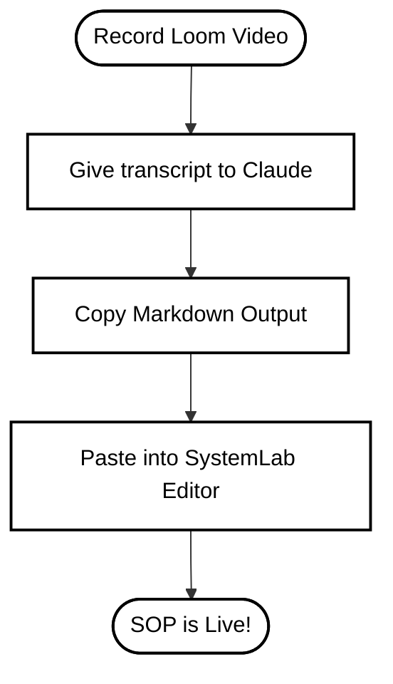

# Team Pixelizt: SystemLab Operating System Guide

Welcome to **SystemLab**, the official operating system for Team Pixelizt. This is where we document exactly how our business runs so anyone can step in, read the instructions, and get the job done right. 

SystemLab is designed to be lightning-fast, simple, and clutter-free. It uses Markdown for writing and syncs everything instantly to the cloud.

---

## 🚀 1. How to Access SystemLab

1. Open the SystemLab application link (provided by your manager).
2. On the login screen, enter your **Work Email**.
3. Enter the Team Pixelizt passcode: `admin` (or `123456`).
4. Hit **Enter Workspace**.

> [!NOTE]
> SystemLab automatically saves your progress as you type. If you lose connection, your changes are stored locally and will sync to the cloud once you are back online.

---

## 🛠 2. How to Use SystemLab

SystemLab is designed to be incredibly fast and simple to use.

### Basic Steps:
1. **Create:** Click the **+ New SOP** button.
2. **Write:** Use the editor on the left to write your steps. Use the insert buttons to easily add checklists, videos, or flowcharts.
3. **Preview:** Watch your document come to life instantly on the right side. You can click the **⛶ Full Screen** button for easier reading.
4. **Save:** Click **Save SOP**. Your work is safely saved and synced in the cloud.

### Pro Tips:
- **Click-to-Edit:** Notice a typo in the preview? Click right on the mistake in the preview pane, and the editor will instantly jump to the exact line of code so you can fix it!
- **Version History:** Don't worry about messing up. Click the **Versions** button to travel back in time and instantly restore old snapshots of your SOP.

---

## 🎯 3. Why & When to Create an SOP

### Why We Use SystemLab:
- **No More Repeating Yourself:** Stop answering the same questions every day. Write the process once, and point the team to SystemLab.
- **Easy Onboarding:** New employees can learn how to do their jobs without constant hand-holding.
- **Consistent Quality:** When everyone follows the same steps, our customers get the same high-quality result every single time.

### When to Create an SOP:
You should create an SOP when a task is:
- **Repetitive:** Something done daily, weekly, or monthly (e.g., "How to process payroll").
- **Important:** If done wrong, it costs us money or upsets customers (e.g., "How to onboard a new client").
- **Time-Consuming:** Tasks that take up too much of a manager's time and need to be delegated.
- **Complex:** Tasks with multiple steps that are easy to forget.

---

## 🏗 4. The 4-Step Systemization Checklist

Building a system just means figuring out the best way to do something, and writing it down. Use this checklist every time you want to build a system:

- [ ] **1. Pick ONE Priority:** Start with the most frustrating or repetitive task. Do not try to systemize everything at once.
- [ ] **2. Record It (Use Loom):** Next time you do the task, record your screen using Loom and explain what you are doing out loud. **Always** include a Loom link at the top of a digital SOP. A 2-minute video saves 20 paragraphs of text.
- [ ] **3. Document It:** Watch the video back and write down the steps as a simple bulleted list in SystemLab.
- [ ] **4. Test It:** Give the SOP to someone else on the team. If they can complete the task without asking you questions, your system works!

---

## 📹 5. Video Resource: The Start-Stop Method

If you are new to writing SOPs for business processes, watch this quick YouTube guide on the Start-Stop method for keeping procedures simple and actionable: 

[](https://www.youtube.com/watch?v=1F2bF2W2lqM)  
*(Click the link or image to watch the video on YouTube)*

---

## 🤖 6. Using Claude to Generate SOPs

You can use AI (like Claude or ChatGPT) to do the heavy lifting when writing your SOPs. 

**CRITICAL:** Do not let the AI write generic, "random" fluff. You must provide it with your *actual business process* (e.g., a transcript of your Loom video or your rough notes).

### The Copy-Paste Claude Prompt

Copy the prompt below, paste it into Claude, and fill in the bracketed `[ ]` information with your actual steps:

```text
I am creating a Standard Operating Procedure (SOP) for my team, Team Pixelizt, in our system called SystemLab. 
SystemLab uses standard GitHub-flavored Markdown and supports Mermaid.js flowcharts.

Please write a clear, concise, and highly actionable SOP based ONLY on the following process notes. Do not add generic business fluff.

Process Notes:
[Paste your Loom transcript, rough notes, or step-by-step instructions here]

Formatting Requirements:
1. Start with an H1 (#) title.
2. Include a short "Purpose" section (H2).
3. If the process has multiple stages, create a simple Mermaid.js flowchart (```mermaid flowchart LR ... ```).
4. Break the steps down using H3 (###) headers.
5. Use bullet points and bold text for emphasis.
6. If I provided a Loom video link, put it at the top under the Purpose.
```

---

## 🗺️ 7. Example Process Flow (Mermaid)

SystemLab supports Mermaid.js. When you use the Claude prompt above, it will generate flowcharts that render directly in SystemLab like this:



> [!TIP]
> **Keep it Simple:** Focus on the 20% of the steps that get 80% of the results. You don't need a 50-page manual. A 5-step checklist in SystemLab paired with a 3-minute Loom video is usually much better!
